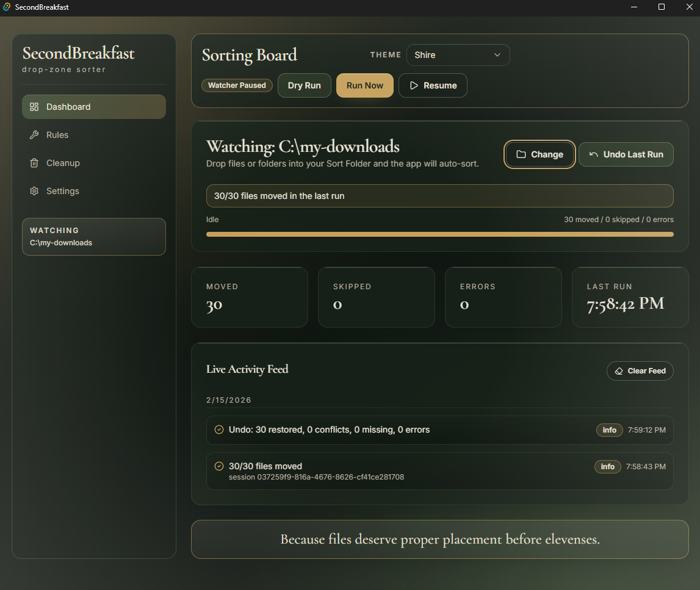
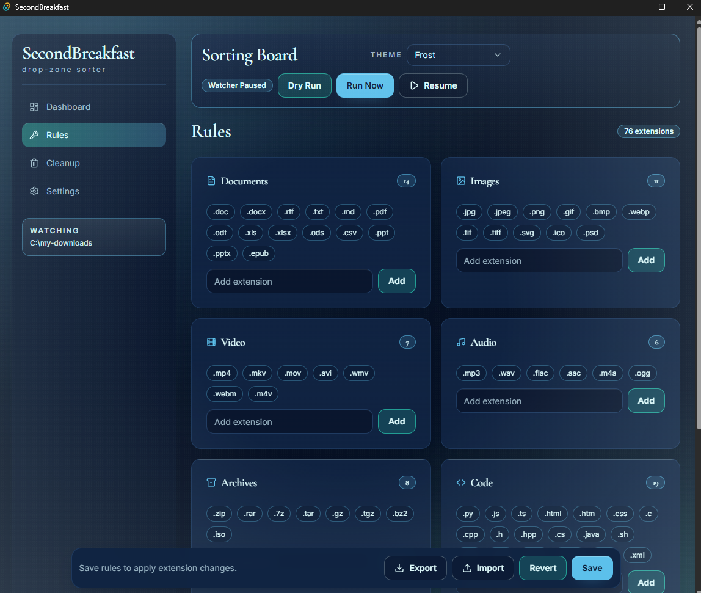
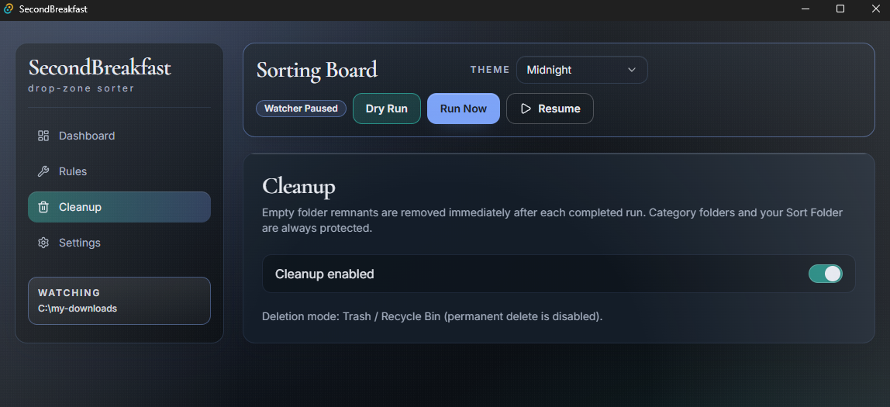
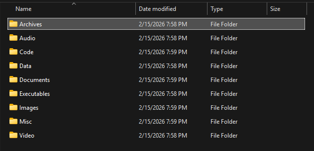
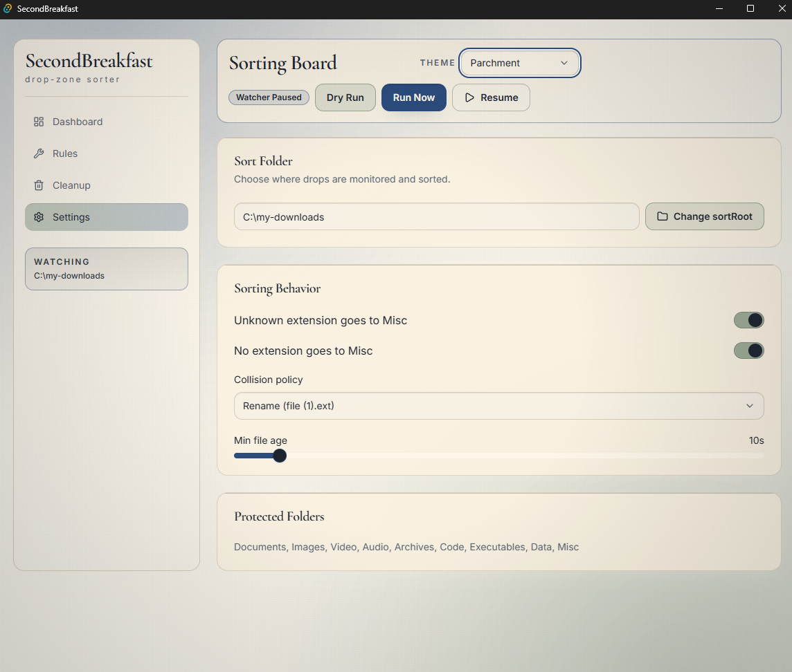

# 🥖 SecondBreakfast

<p align="center">
  
</p>


**v1.0.0 — Officially out of the Shire.**

SecondBreakfast is a real-time drop-folder organizer inspired by the comforts of a well-ordered Hobbit hole.

Choose a **Sort Folder**, and the app keeps watch like a dutiful Hobbit, automatically sorting any files or folders dropped inside into neat category subfolders — all within the same directory. Reliable, unobtrusive, and perfectly content to work quietly while you enjoy second breakfast.

Built with **Tauri v2 + React + Tailwind + shadcn-style UI**, powered by a Rust backend that takes order very seriously.

---

## 🍃 What It Does

SecondBreakfast watches a configurable `sortRoot` and automatically routes incoming files into:

* `Documents`
* `Images`
* `Video`
* `Audio`
* `Archives`
* `Code`
* `Executables`
* `Data`
* `Misc`

Drop a single file.  
Drop an entire folder tree.  
Walk away.  

Everything finds its proper place.

---

## 🎨 Selectable Themes

SecondBreakfast includes **four built-in visual themes**, selectable from the top of the app.

Each theme adjusts the full color palette — backgrounds, accents, borders, and highlights — letting you choose the mood of your Hobbit hole.

Switch themes instantly without restarting the app.

Because even Hobbits redecorate.

---

## 📊 Dashboard

<p align="center">
  
</p>

The command center of your Hobbit hole.  
Monitor watcher status, run sorting manually, undo the last run, and track activity in real time.

---

## 🏷 Rules Editor

<p align="center">
  
</p>

Customize which extensions belong to each category.  
Add, remove, export, or import rule sets with simple extension chips.

---

## 🧹 Cleanup Settings

<p align="center">
  
</p>

Control empty-folder cleanup behavior and protect important directories.  
SecondBreakfast keeps things tidy — but only when you say so.

---

## 🛡 Protected Folders

<p align="center">
  
</p>

Core category folders are auto-created and protected to ensure sorting remains stable and predictable.

---

## ⚙ Settings

<p align="center">
  
</p>

Change your Sort Folder anytime and toggle global behavior options.

---

## 🔁 Undo System (Now with Restored Folder)

Undo no longer drops files back into unpredictable locations.

Instead, restored files are placed under:

```
<sortRoot>/Restored/<session_id>/...
```

Preserving their original directory structure in a safe, isolated location.

Because even Hobbits believe in second chances.

---

## 🛠 Development

### Prerequisites

* Node.js 20+
* Rust toolchain
* Tauri desktop prerequisites for your OS

Install dependencies:

```bash
npm install
```

Frontend build check:

```bash
npm run build
```

Rust backend check:

```bash
cd src-tauri
cargo check
```

Run acceptance tests:

```bash
cd src-tauri
cargo test acceptance_ -- --nocapture
```

Run desktop app in dev mode:

```bash
npm run tauri dev
```

---

## 🚀 Releases

### v1.0.0

* Stable real-time watcher
* Deterministic undo system with `Restored/<session_id>` isolation
* Acceptance-tested planner + executor
* Config persistence via OS config directory
* Four selectable UI themes
* Windows installer auto-build via GitHub Actions

---

## 🏷 Version Bump Workflow

Local:

```bash
npm run bump:version -- 1.0.1
```

Updates:

* `package.json`
* `src-tauri/Cargo.toml`
* `src-tauri/tauri.conf.json`

---

## 📦 Auto-Release Workflow

Push a version tag (example `v1.0.0`) and GitHub Actions will build and publish Windows installers automatically.

Workflow:

```
.github/workflows/release-windows.yml
```

Published assets:

* `.msi` installer
* `-setup.exe` installer

---

## 💾 Config Persistence

Rules are stored in your OS config directory:

```
sort-root/rules.json
```

Undo journal is append-only JSONL:

```
sort-root/journal.jsonl`
```

---

## 📜 Documentation

See:

* `docs/BUILD.md`
* `docs/ACCEPTANCE.md`
* `docs/RELEASE_CHECKLIST.md`
* `docs/THEME_TOKENS.md`
* `docs/SPEC.md`

---

## Disclaimer

SecondBreakfast is provided “as is”, without warranty of any kind.  
Always test with non-critical files before using on important data.  
Use at your own risk.
